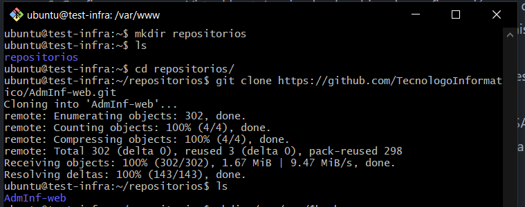
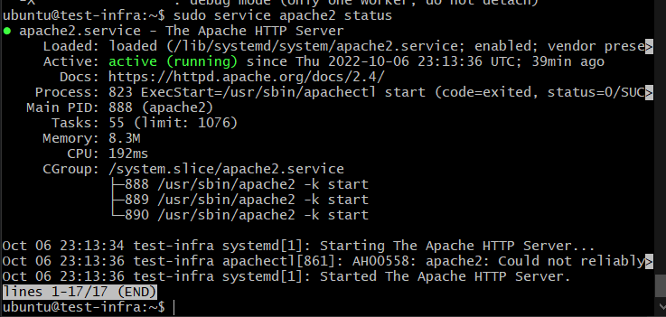
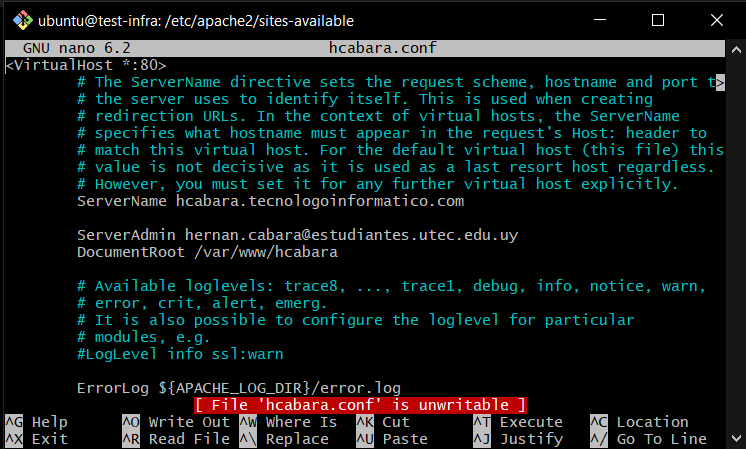
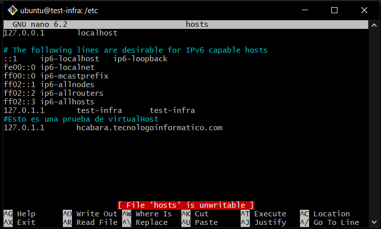
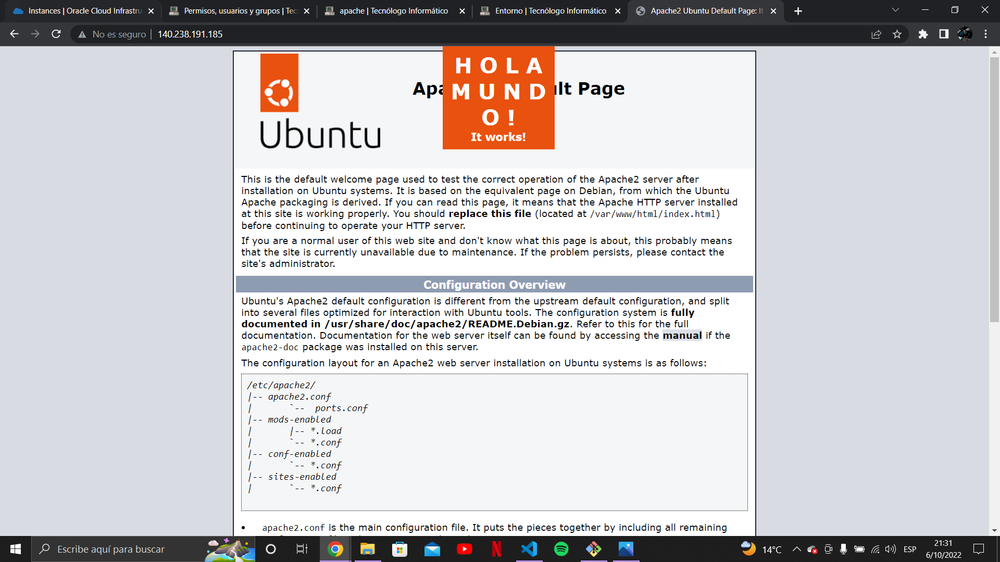
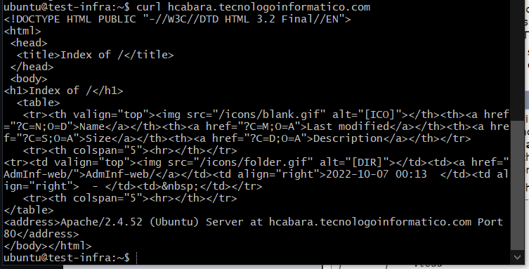

# apache

Reemplace `$ALUMNO` por el nombre de su nombre de usuario en www.tecnologoinformatico.com

EJ: `dmascheroni`

1. Cree el directorio ~/repositorios y dentro clone el
repositorio: `https://github.com/TecnologoInformatico/AdmInf-web.git`



2. Actualice el repositorio de la lista de paquetes.
    `apt update`
3. Instalar el servidor Apache mediante apt.
    Ya tengo el servidor instalado


4. Cree el directorio /var/www/$ALUMNO

`sudo mkdir /var/www/hcabara` 

5. Asigne como propietario del directorio su usuario.

`sudo chown -R ubuntu:ubuntu hcabara/` 


6. Configure un nuevo Virtual host. (copiando el archivo de configuración por defecto)
  6.1. ServerName $ALUMNO.tecnologoinformatico.com
  6.2. Correo de contacto con el administrador.
  6.3. El root de la aplicación. (/var/www/$ALUMNO)

  
  
7. Modifique el archivo /etc/hosts de modo que el ServerName coincida con este equipo `127.0.0.1`.

  


8. Reinicie el servidor apache para que los cambios tengan efecto.

`sudo systemctl reload apache2` 

9. Copie el contenido del directorio ~/repositorios/AdmInf-web a /var/www/$ALUMNO, de tal modo que el contenido del repositorio antes clonado se encuentre en el root de la aplicación.

`sudo cp -r ~/repositorios/AdmInf-web /var/www/hcabara`


10. Verifique que el servidor funcione correctamente.

  
  

11. Ingrese la IP del servidor y el servername a continuación:

```json
{
    "serverName": "hcabara.tecnologoinformatico.com",
    "ip": "140.238.191.185"
}
```